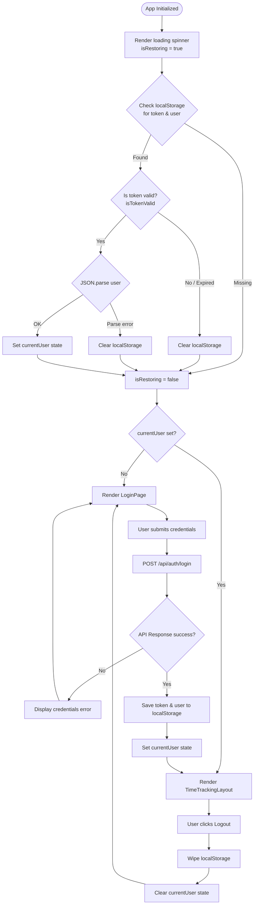
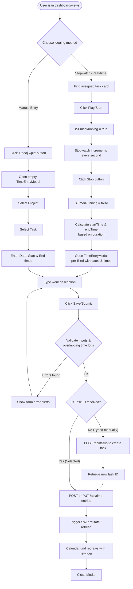
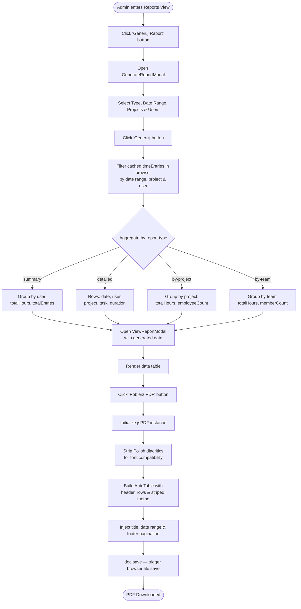

# Frontend Flowcharts

This document visualizes the main user flows and component state lifecycles in the Time Tracking System frontend using Mermaid diagrams.

---

## 1. Authentication & Session Restoration Flow

This diagram shows how `app/page.tsx` routes between `LoginPage` and `TimeTrackingLayout` during initialization and user interactions.

---

## 2. Work Time Logging Flow (Stopwatch vs. Manual)

This flowchart illustrates the dual logging pathways: real-time stopwatch logging and manual retrospective logging.

---

## 3. Report Generation & PDF Export Flow

This diagram illustrates how an Administrator generates reports client-side and prints them to a PDF document.

