# Time Tracking System — Full Documentation


---

## Table of Contents

1. [Overview (README)](#time-tracking-system--backend-documentation)
2. [Setup Guide](#setup-guide)
3. [System Architecture](#system-architecture)
4. [Business Rules Reference](#business-rules-reference)
5. [Projects API Reference](#projects-api-reference)
6. [Time Entries API Reference](#time-entries-api-reference)
7. [Reports API Reference](#reports-api-reference)
8. [Teams API Reference](#teams-api-reference)
9. [Frontend Technical Documentation](#frontend-technical-documentation)
10. [Frontend Flowcharts](#frontend-flowcharts)
11. [Frontend Use Cases](#frontend-use-cases-uc)
12. [Frontend User Manual](#frontend-user-manual)
13. [Testing User Manual & Developer Guide](#testing-user-manual--developer-guide)
14. [Full-Stack Testing Architecture Documentation](#full-stack-testing-architecture-documentation)

---

<!-- Source: docs/README.md -->

# Time Tracking System — Backend Documentation

A REST API backend for logging and reporting employee work time against project tasks.
Built with Spring Boot 3.4.1, secured with JWT, and backed by PostgreSQL.

---

## Tech Stack

| Component       | Version / Tool             |
|-----------------|----------------------------|
| Framework       | Spring Boot 3.4.1          |
| Language        | Java 21 (JDK toolchain)    |
| Database        | PostgreSQL 15              |
| Migrations      | Flyway                     |
| Security        | Spring Security + JWT      |
| Build tool      | Gradle (Wrapper included)  |
| Local DB        | Docker Compose             |

---

## Documentation Index

### Backend Documentation
| File | Contents |
|------|----------|
| [SETUP.md](SETUP.md) | Prerequisites, clone, start DB, run backend, troubleshooting |
| [API_PROJECTS.md](API_PROJECTS.md) | Projects CRUD endpoints |
| [API_TEAMS.md](API_TEAMS.md) | Teams CRUD + member management endpoints |
| [API_TIMEENTRIES.md](API_TIMEENTRIES.md) | Time entry logging and timer endpoints |
| [API_REPORTS.md](API_REPORTS.md) | Report generation endpoints |
| [ARCHITECTURE.md](ARCHITECTURE.md) | Package structure, layer responsibilities, DB schema |
| [BUSINESS_RULES.md](BUSINESS_RULES.md) | All validation and business logic rules |

### Frontend Documentation (React / Next.js)
| File | Contents |
|------|----------|
| [FRONTEND_DOCUMENTATION.md](FRONTEND_DOCUMENTATION.md) | Technical stack, directory structure, SWR & caching, mapping layer |
| [FRONTEND_USE_CASES.md](FRONTEND_USE_CASES.md) | Full description of Employee and Admin functional use cases |
| [FRONTEND_USER_MANUAL.md](FRONTEND_USER_MANUAL.md) | User manual and step-by-step guides for logging time and managing teams |
| [FRONTEND_FLOWCHARTS.md](FRONTEND_FLOWCHARTS.md) | Visual Mermaid flowcharts for auth, logging, and reporting |

---

## Quick Start

```bash
# 1. Start the database
cd tts
docker-compose up -d

# 2. Run the backend
./gradlew bootRun

# 3. Verify it's up
curl http://localhost:8080/api/reports
```

The app is ready when you see:
```
Started TimeTrackingApplication in X.XXX seconds
```

> If `./gradlew` fails with "JAVA_HOME not set", see [SETUP.md](SETUP.md) for platform-specific instructions.

---

## API Base URL

```
http://localhost:8080
```

Most endpoints require a JWT token in the `Authorization` header:

```
Authorization: Bearer <token>
```

Obtain a token via `POST /api/auth/login`. Report endpoints (`/api/reports/**`) and
user registration (`POST /api/users`) are public and do not require authentication.

---

<!-- Source: docs/SETUP.md -->

# Setup Guide

Full instructions to get the Time Tracking System backend running locally.

---

## Prerequisites

| Tool | Minimum version | Notes |
|------|-----------------|-------|
| Git | any | |
| Docker | 20+ | Required to run PostgreSQL |
| Docker Compose | v2 (`docker compose`) or v1 (`docker-compose`) | Bundled with Docker Desktop |
| JDK | 21+ | See notes below |

**JDK options:**
- IntelliJ IDEA can download a JDK automatically (Settings → SDKs → +).
  Common download locations: `~/.jdks/ms-21.0.x` or `~/.jdks/openjdk-26.0.x`.
- Or install manually: `sdk install java 21-tem` (SDKMAN), `brew install openjdk@21`, etc.

---

## 1. Clone the Repository

```bash
git clone https://github.com/NeinWolf/2026_DSA_3_KIMAK.git
cd 2026_DSA_3_KIMAK
```

---

## 2. Start the Database

The `docker-compose.yml` is located inside the `tts/` subdirectory.

```bash
cd tts
docker-compose up -d
```

Verify it is running:

```bash
docker ps
```

You should see `tts_postgres` listed with port `5432` mapped.

---

## 3. Run the Backend

From the `tts/` directory:

```bash
./gradlew bootRun
```

If `JAVA_HOME` is not set, specify it explicitly (adjust the path to your JDK):

```bash
JAVA_HOME=~/.jdks/ms-21.0.11 PATH=~/.jdks/ms-21.0.11/bin:$PATH ./gradlew bootRun
```

Check available JDKs with: `ls ~/.jdks/`

The app is ready when you see:

```
Started TimeTrackingApplication in X.XXX seconds
```

---

## 4. Verify Setup

Check that the API responds:

```bash
curl http://localhost:8080/api/reports
```

Expected response: `[]` (empty list — no reports generated yet).

Connect to the database and inspect tables:

```bash
docker exec -it tts_postgres psql -U postgres -d timetracking
```

Inside psql:

```sql
\dt
\q
```

You should see: `flyway_schema_history`, `projects`, `reports`, `task_assignments`,
`tasks`, `team_members`, `teams`, `time_entries`, `users`.

---

## Environment Variables Reference

All settings are in `tts/src/main/resources/application.properties`.

| Property | Default | Description |
|----------|---------|-------------|
| `spring.datasource.url` | `jdbc:postgresql://localhost:5432/timetracking` | JDBC URL |
| `spring.datasource.username` | `postgres` | DB username |
| `spring.datasource.password` | `postgres` | DB password |
| `spring.jpa.hibernate.ddl-auto` | `none` | Flyway owns the schema — do not change to `update` |
| `spring.flyway.enabled` | `true` | Runs migrations on startup |
| `spring.flyway.locations` | `classpath:db/migration` | Migration scripts path |

### Database credentials (Docker default)

| Field | Value |
|-------|-------|
| Host | `localhost` |
| Port | `5432` |
| Database | `timetracking` |
| Username | `postgres` |
| Password | `postgres` |

---

## Platform Notes

### Windows

Replace `./gradlew` with `gradlew.bat`. Set `JAVA_HOME` from Command Prompt:

```cmd
set JAVA_HOME=%USERPROFILE%\.jdks\ms-21.0.11
set PATH=%JAVA_HOME%\bin;%PATH%
gradlew.bat bootRun
```

Use `docker-compose` (with hyphen) if you have Compose v1.

### Arch-based Linux (CachyOS, Manjaro, etc.)

Add your user to the `docker` group to avoid `permission denied` on the Docker socket:

```bash
sudo usermod -aG docker $USER
```

Log out and back in for it to take effect. Until then, prefix docker commands with `sudo`.

### Ubuntu / Debian

```bash
sudo apt install docker.io docker-compose -y
sudo usermod -aG docker $USER
```

Log out and back in, then proceed from Step 2.

---

## Troubleshooting

**Port 5432 already in use:**

```bash
sudo ss -tlnp | grep 5432
```

Stop whatever is using it (another Docker container, a local PostgreSQL install, etc.),
then retry `docker-compose up -d`.

**Permission denied on Docker socket:**

```bash
sudo usermod -aG docker $USER
newgrp docker   # applies in the current session immediately
```

**App crashes on startup with connection error:**

Make sure the Docker container is running *before* starting the app.
PostgreSQL must be fully up (check `docker ps` — state should be `Up`).

**Tables not created / Flyway errors:**

The project uses Flyway for schema management. `ddl-auto` is intentionally set to `none` —
Hibernate does *not* create tables. If you see Flyway migration errors, check:

```bash
docker exec -it tts_postgres psql -U postgres -d timetracking -c "SELECT * FROM flyway_schema_history;"
```

A failed migration will block the app. Fix the migration file or reset with:

```bash
docker-compose down -v   # deletes all data
docker-compose up -d
```

---

## Stopping Everything

Stop the app: `Ctrl+C` in the terminal running `bootRun`.

Stop the database (keep data):

```bash
docker-compose down
```

Stop the database and delete all stored data:

```bash
docker-compose down -v
```

---

<!-- Source: docs/ARCHITECTURE.md -->

# System Architecture

---

## System Overview

```
┌─────────────────────────────────────────────────────┐
│                     HTTP Clients                     │
│            (browser, curl, Postman, frontend)        │
└───────────────────────┬─────────────────────────────┘
                        │  HTTP/REST (port 8080)
┌───────────────────────▼─────────────────────────────┐
│                Spring Security Filter                │
│          (JWT validation on every request)           │
└───────────────────────┬─────────────────────────────┘
                        │
┌───────────────────────▼─────────────────────────────┐
│                  Controller Layer                    │
│  AuthController  ProjectController  TaskController   │
│  UserController  TimeEntryController ReportController│
│  TeamController                                      │
└───────────────────────┬─────────────────────────────┘
                        │  method calls
┌───────────────────────▼─────────────────────────────┐
│                   Service Layer                      │
│  AuthService  ProjectService   TaskService           │
│  UserService  TimeEntryService ReportService         │
│  TeamService  JwtService                             │
└───────────────────────┬─────────────────────────────┘
                        │  Spring Data JPA
┌───────────────────────▼─────────────────────────────┐
│                 Repository Layer                     │
│  UserRepository     ProjectRepository               │
│  TaskRepository     TimeEntryRepository             │
│  TeamRepository     ReportRepository                │
└───────────────────────┬─────────────────────────────┘
                        │  JDBC (PostgreSQL driver)
┌───────────────────────▼─────────────────────────────┐
│              PostgreSQL 15 Database                  │
│           (Docker container: tts_postgres)           │
│         Schema managed by Flyway migrations          │
└─────────────────────────────────────────────────────┘
```

---

## Package Structure

```
com.timetracking/
│
├── TimeTrackingApplication.java       — @SpringBootApplication entry point
│
├── config/
│   ├── GlobalExceptionHandler.java    — @RestControllerAdvice, maps exceptions to HTTP
│   ├── JwtAuthenticationFilter.java   — reads JWT from Authorization header
│   └── SecurityConfig.java            — Spring Security filter chain, public routes
│
├── controller/
│   ├── AuthController.java            — POST /api/auth/login
│   ├── ProjectController.java         — /api/projects CRUD
│   ├── TaskController.java            — /api/tasks CRUD + assign endpoint
│   ├── TeamController.java            — /api/teams CRUD + member management
│   ├── TimeEntryController.java       — /api/time-entries CRUD
│   ├── UserController.java            — /api/users CRUD
│   └── ReportController.java          — /api/reports generation
│
├── service/
│   ├── AuthService.java               — login, password verification
│   ├── JwtService.java                — token generation and validation
│   ├── ProjectService.java            — project CRUD + date validation
│   ├── TaskService.java               — task CRUD + user assignment
│   ├── TeamService.java               — team CRUD + member add/remove
│   ├── TimeEntryService.java          — timer logic, overlap check, duration calc
│   ├── UserService.java               — user CRUD + password hashing
│   └── ReportService.java             — report aggregation and persistence
│
├── repository/
│   ├── UserRepository.java
│   ├── ProjectRepository.java
│   ├── TaskRepository.java
│   ├── TimeEntryRepository.java
│   ├── TeamRepository.java
│   └── ReportRepository.java
│
├── entity/
│   ├── User.java                      — users table
│   ├── Role.java                      — ADMIN | EMPLOYEE enum
│   ├── Team.java                      — teams table
│   ├── Project.java                   — projects table
│   ├── Task.java                      — tasks table
│   ├── TaskStatus.java                — TODO | IN_PROGRESS | DONE enum
│   ├── TimeEntry.java                 — time_entries table
│   ├── Report.java                    — reports table
│   └── ReportType.java                — SUMMARY | DETAILED | PER_PROJECT | PER_TEAM enum
│
└── dto/
    ├── LoginRequestDTO.java
    ├── AuthResponseDTO.java
    ├── UserRequestDTO.java / UserResponseDTO.java
    ├── UserSummaryDTO.java                        — id + username projection for team members
    ├── ProjectRequestDTO.java / ProjectResponseDTO.java
    ├── TaskRequestDTO.java / TaskResponseDTO.java
    ├── TeamRequestDTO.java / TeamResponseDTO.java
    ├── TimeEntryRequestDTO.java / TimeEntryResponseDTO.java
    └── report/
        ├── ReportResponseDTO.java     — generic wrapper <T>
        ├── SummaryReportItemDTO.java
        ├── DetailedReportItemDTO.java
        ├── ProjectReportItemDTO.java
        └── TeamReportItemDTO.java
```

---

## Layer Descriptions

### Controller Layer

Receives HTTP requests, delegates to the service, and returns HTTP responses.

**Does:** maps HTTP verbs and paths to service calls, validates request bodies with `@Valid`,
sets HTTP status codes.

**Does NOT do:** contain business logic, access repositories directly, or manipulate
database objects. Controllers only work with DTOs.

### Service Layer

Contains all business logic. Reads and writes data through repositories.
Throws `ResponseStatusException` for any business rule violation — `GlobalExceptionHandler`
converts these into JSON error responses.

**Business logic lives here:** date validation, overlap checks, duration calculation,
report aggregation, password hashing, JWT issuance.

### Repository Layer

Spring Data JPA interfaces that extend `JpaRepository<Entity, Long>`.
Provide standard CRUD out of the box plus custom derived queries declared by method name
(e.g. `findByUserId`, `findByUserIdAndIsActiveTrue`).

**Does NOT:** contain business logic. Only query methods.

### Entity Layer

JPA-annotated classes that map 1:1 to database tables.
Annotated with Lombok `@Getter @Setter` to reduce boilerplate.
Relationships are declared with `@ManyToOne`, `@OneToMany`, `@ManyToMany`.

`@JsonIgnore` is placed on collection fields to prevent circular serialization
(e.g. `User.timeEntries`, `Task.timeEntries`).

### DTO Layer

Plain Java classes used for HTTP request and response bodies.
DTOs decouple the API contract from the database schema, allowing each to evolve
independently. They also prevent accidental exposure of internal fields
(e.g. `passwordHash` is never in a response DTO).

Request DTOs carry `@NotNull` / `@NotBlank` annotations for Bean Validation.
Response DTOs have static `fromEntity(Entity)` factory methods.

---

## Database Schema

All tables are created and migrated by Flyway.

| Table | Purpose |
|-------|---------|
| `users` | User accounts; stores username, bcrypt password hash, and role (ADMIN/EMPLOYEE) |
| `teams` | Named groups of users |
| `team_members` | Join table: user ↔ team (many-to-many) |
| `projects` | Projects with optional start/end dates |
| `project_teams` | Join table: project ↔ team (many-to-many, DB only — no Java entity) |
| `tasks` | Tasks belonging to a project; each has a status (TODO/IN_PROGRESS/DONE) |
| `task_assignments` | Join table: task ↔ user (who is assigned to what) |
| `time_entries` | Work time logs; `end_time = NULL` means a running timer |
| `reports` | Metadata for generated reports (type, date range, who generated it) |

### Key constraints (from Flyway migrations)

- `time_entries.end_time > start_time` (when not null)
- `projects.end_date >= start_date` (when not null)
- Project and task names cannot be blank (`TRIM(name) <> ''`)
- `reports.generated_by` uses `ON DELETE SET NULL` — deleting a user does not delete report history

---

## Flyway and Hibernate

**Flyway** runs on startup before the application serves any requests.
It applies all pending SQL migration files from `src/main/resources/db/migration/`
in version order (`V1__`, `V2__`, `V2_1__`, etc.).

**Hibernate** is configured with `ddl-auto=none`, meaning it does **not** create
or alter tables. Hibernate only generates the SQL for `INSERT`, `SELECT`, `UPDATE`,
and `DELETE` operations at runtime.

The two tools have complementary roles: Flyway owns the schema lifecycle,
Hibernate owns the runtime data access.

### Migration files

| File | Contents |
|------|----------|
| `V1__initital_schema.sql` | Creates all 9 tables |
| `V1_1__test_data.sql` | Seeds initial test data |
| `V2__constraints.sql` | Adds check constraints and fixes FK for reports |
| `V2_1__optymalizacja.sql` | Adds indexes on join tables and `time_entries` |

---

## Docker

The `tts/docker-compose.yml` file defines a single service:

```yaml
postgres:
  image: postgres:15
  container_name: tts_postgres
  environment:
    POSTGRES_DB: timetracking
    POSTGRES_USER: postgres
    POSTGRES_PASSWORD: postgres
  ports:
    - "5432:5432"
  volumes:
    - postgres_data:/var/lib/postgresql/data
```

Data is persisted in a named Docker volume (`postgres_data`) so it survives container
restarts. Remove it with `docker-compose down -v` to start with a clean database.

The Spring Boot application runs outside Docker (via `./gradlew bootRun`) and connects
to the container over `localhost:5432`.

---

<!-- Source: docs/BUSINESS_RULES.md -->

# Business Rules Reference

All validation and business logic enforced by the backend services.
Errors are returned in the standard format from `GlobalExceptionHandler`:

```json
{ "status": 400, "message": "<reason>" }
```

---

## Projects

### Date validation
`endDate` cannot be before `startDate`.

- Applies to: `POST /api/projects`, `PUT /api/projects/{id}`
- Condition: `endDate != null && startDate != null && endDate.isBefore(startDate)`
- Response: **400** `End date cannot be before start date`
- Both dates are optional — the check only fires when both are provided.

### Delete protection
A project that still has tasks cannot be deleted.

- Applies to: `DELETE /api/projects/{id}`
- Condition: `taskRepository.findByProjectId(id)` returns a non-empty list
- Response: **409** `Cannot delete project with existing tasks`
- Resolution: delete or reassign all tasks first, then delete the project.

---

## Teams

### Duplicate membership prevention
A user cannot be added to a team they already belong to.

- Applies to: `POST /api/teams/{teamId}/members/{userId}`
- Condition: `team.getMembers().contains(user)`
- Response: **409** `User is already a member of this team`
- Resolution: no action needed — the user is already in the team.

### Non-member removal prevention
A user cannot be removed from a team they do not belong to.

- Applies to: `DELETE /api/teams/{teamId}/members/{userId}`
- Condition: `!team.getMembers().contains(user)`
- Response: **400** `User is not a member of this team`

### No delete restriction on non-empty teams
Deleting a team succeeds regardless of whether it has members.
Members are removed from the team but their user accounts are unaffected.

- Applies to: `DELETE /api/teams/{id}`
- Only protection: **404** `Team not found` if the ID does not exist.

---

## Tasks

### Project must exist
The `projectId` in the request body must reference an existing project.

- Applies to: `POST /api/tasks`, `PUT /api/tasks/{id}`
- Response: **404** `Project not found`

### Assigned users must exist
Every `userId` in `assignedUserIds` must reference an existing user.

- Applies to: `POST /api/tasks`, `PUT /api/tasks/{id}`
- Response: **404** `One or more assigned users not found`

---

## Time Entries

### End time ordering
`endTime` cannot be before `startTime`.

- Applies to: `POST /api/time-entries`, `PUT /api/time-entries/{id}`
- Condition: `endTime != null && endTime.isBefore(startTime)`
- Response: **400** `End time cannot be before start time`

### Active timer flag
Whether a timer is still running is derived automatically from `endTime`:

| `endTime` value | `isActive` | `durationMinutes` |
|-----------------|------------|-------------------|
| `null`          | `true`     | `null`            |
| provided        | `false`    | calculated        |

Duration is calculated as `Duration.between(startTime, endTime).toMinutes()`.

### Overlap validation (active timer conflict)
A user cannot have two active timers simultaneously.

- Applies to: `POST /api/time-entries` only (when `endTime` is `null`)
- Condition: user already has at least one entry where `isActive = true`
- Response: **409** `User already has an active time entry`
- Resolution: stop the existing active entry first (`PUT /api/time-entries/{id}` with an `endTime`), then start a new one.

### User and task must exist
Both `userId` and `taskId` must reference existing records.

- Applies to: `POST /api/time-entries`, `PUT /api/time-entries/{id}`
- Response: **404** `User not found` or **404** `Task not found`

---

## Reports

### Both dates required
`startDate` and `endDate` are required query parameters for all generation endpoints.

- Applies to: `GET /api/reports/summary`, `/detailed`, `/by-project`, `/by-team`
- Condition: either parameter is absent or null
- Response: **400** `Both startDate and endDate are required`

### Date order
`startDate` cannot be after `endDate`.

- Response: **400** `Start date cannot be after end date`

### Maximum range
The date range cannot span more than 366 days.

- Condition: `ChronoUnit.DAYS.between(startDate, endDate) > 366`
- Response: **400** `Date range cannot exceed 366 days`

### Active entries excluded
Time entries with `endTime = null` (active timers) are never included in any report.
Only completed entries (where `endTime` is set) are counted.

### Entry inclusion window
An entry is included in a report when its `startTime` falls within
`[startDate 00:00:00, endDate 23:59:59]`.

### Report metadata saved
Every successful call to a generation endpoint persists a `Report` record to the database.
The record stores the report type, date range, generation timestamp, and the first available
ADMIN user as `generatedBy` (or any user if no ADMIN exists).
This metadata is returned by `GET /api/reports`.

### Hours calculation
Hours are calculated as `toMinutes() / 60.0`, rounded to 2 decimal places.

---

## Authentication

### Token required
All endpoints except the following require a valid JWT in `Authorization: Bearer <token>`:

- `POST /api/auth/login`
- `POST /api/users` (registration)
- `GET /api/reports/**`

### Invalid or missing token
Returns **401 Unauthorized** (handled by Spring Security before reaching any controller).

---

<!-- Source: docs/API_PROJECTS.md -->

# Projects API Reference

Base URL: `http://localhost:8080/api/projects`

All endpoints require authentication. Include the JWT token in every request:
```
Authorization: Bearer <token>
```

---

## Error Response Format

All errors use this structure (from `GlobalExceptionHandler`):

```json
{ "status": 404, "message": "Project not found" }
```

---

## Endpoints

---

### GET /api/projects

Returns all projects.

**Response 200:**

```json
[
  {
    "id": 1,
    "name": "Time Tracking System",
    "description": "Internal employee time logging platform",
    "startDate": "2026-01-01",
    "endDate": "2026-12-31"
  },
  {
    "id": 2,
    "name": "Mobile App Redesign",
    "description": null,
    "startDate": "2026-03-01",
    "endDate": null
  }
]
```

Returns `[]` if no projects exist.

**Example curl:**

```bash
curl -H "Authorization: Bearer <token>" \
     http://localhost:8080/api/projects
```

---

### GET /api/projects/{id}

Returns a single project by ID.

**Path parameter:**

| Name | Type | Description |
|------|------|-------------|
| id | Long | Project ID |

**Response 200:**

```json
{
  "id": 1,
  "name": "Time Tracking System",
  "description": "Internal employee time logging platform",
  "startDate": "2026-01-01",
  "endDate": "2026-12-31"
}
```

**Errors:**

| Status | Message |
|--------|---------|
| 404 | `Project not found` |

**Example curl:**

```bash
curl -H "Authorization: Bearer <token>" \
     http://localhost:8080/api/projects/1
```

---

### POST /api/projects

Creates a new project.

**Request Body:**

| Field | Type | Required | Constraints |
|-------|------|----------|-------------|
| name | String | yes | not blank |
| description | String | no | — |
| startDate | String (LocalDate) | no | format `YYYY-MM-DD` |
| endDate | String (LocalDate) | no | format `YYYY-MM-DD`; cannot be before `startDate` |

**Example request body:**

```json
{
  "name": "Time Tracking System",
  "description": "Internal employee time logging platform",
  "startDate": "2026-01-01",
  "endDate": "2026-12-31"
}
```

Minimal valid request (dates optional):

```json
{
  "name": "Quick Project"
}
```

**Response 201:**

```json
{
  "id": 3,
  "name": "Time Tracking System",
  "description": "Internal employee time logging platform",
  "startDate": "2026-01-01",
  "endDate": "2026-12-31"
}
```

**Errors:**

| Status | Message |
|--------|---------|
| 400 | `End date cannot be before start date` |
| 400 | `{"name": "must not be blank"}` (validation error format) |

**Example curl:**

```bash
curl -X POST http://localhost:8080/api/projects \
     -H "Authorization: Bearer <token>" \
     -H "Content-Type: application/json" \
     -d '{"name":"Time Tracking System","startDate":"2026-01-01","endDate":"2026-12-31"}'
```

---

### PUT /api/projects/{id}

Replaces an existing project. All writable fields are overwritten with the request body values.

**Path parameter:**

| Name | Type | Description |
|------|------|-------------|
| id | Long | Project ID |

**Request Body:** same fields as `POST /api/projects`.

**Response 200:** updated project (same structure as GET).

**Errors:**

| Status | Message |
|--------|---------|
| 400 | `End date cannot be before start date` |
| 400 | Validation error for missing/invalid fields |
| 404 | `Project not found` |

**Example curl:**

```bash
curl -X PUT http://localhost:8080/api/projects/1 \
     -H "Authorization: Bearer <token>" \
     -H "Content-Type: application/json" \
     -d '{"name":"TTS v2","startDate":"2026-01-01","endDate":"2027-06-30"}'
```

---

### DELETE /api/projects/{id}

Deletes a project. Fails if the project has any tasks.

**Path parameter:**

| Name | Type | Description |
|------|------|-------------|
| id | Long | Project ID |

**Response 204:** no body.

**Errors:**

| Status | Message |
|--------|---------|
| 404 | `Project not found` |
| 409 | `Cannot delete project with existing tasks` |

To delete a project that has tasks: delete or reassign all its tasks first.

**Example curl:**

```bash
curl -X DELETE http://localhost:8080/api/projects/1 \
     -H "Authorization: Bearer <token>"
```

---

<!-- Source: docs/API_TIMEENTRIES.md -->

# Time Entries API Reference

Base URL: `http://localhost:8080/api/time-entries`

All endpoints require authentication. Include the JWT token in every request:
```
Authorization: Bearer <token>
```

---

## Business Rules

### Active timer vs completed entry

Whether a timer is "running" is determined by the `endTime` field:

| `endTime` in request | Stored `isActive` | `durationMinutes` in response |
|----------------------|-------------------|-------------------------------|
| `null` (omitted)     | `true`            | `null`                        |
| provided             | `false`           | calculated automatically      |

Duration is `endTime - startTime` in whole minutes.

### Overlap validation

A user cannot have two active timers at the same time.
When creating a new entry with `endTime = null`, the system checks whether the user
already has any entry with `isActive = true`. If so, the request is rejected with **409**.

**To start a new timer:** stop the existing active entry first by calling
`PUT /api/time-entries/{id}` with an `endTime`, then create the new one.

### End time ordering

`endTime` must not be before `startTime`. Violating this returns **400**.

---

## DateTime Format

All `startTime` and `endTime` values use ISO 8601 local datetime:

```
"2026-05-11T09:00:00"
```

No timezone suffix. The server treats all timestamps as local server time.

---

## Error Response Format

```json
{ "status": 404, "message": "Time entry not found" }
```

---

## Endpoints

---

### GET /api/time-entries

Returns all time entries.

**Response 200:**

```json
[
  {
    "id": 1,
    "userId": 2,
    "username": "anna_kowalska",
    "taskId": 5,
    "taskName": "Implement login page",
    "projectId": 1,
    "projectName": "Time Tracking System",
    "startTime": "2026-05-11T09:00:00",
    "endTime": "2026-05-11T11:30:00",
    "isActive": false,
    "durationMinutes": 150,
    "description": "Frontend auth flow"
  },
  {
    "id": 2,
    "userId": 3,
    "username": "jan_nowak",
    "taskId": 6,
    "taskName": "Write unit tests",
    "projectId": 1,
    "projectName": "Time Tracking System",
    "startTime": "2026-05-11T10:00:00",
    "endTime": null,
    "isActive": true,
    "durationMinutes": null,
    "description": null
  }
]
```

Returns `[]` if no entries exist.

**Example curl:**

```bash
curl -H "Authorization: Bearer <token>" \
     http://localhost:8080/api/time-entries
```

---

### GET /api/time-entries/{id}

Returns a single time entry by ID.

**Path parameter:**

| Name | Type | Description |
|------|------|-------------|
| id | Long | Time entry ID |

**Response 200:** single time entry object (same structure as above).

**Errors:**

| Status | Message |
|--------|---------|
| 404 | `Time entry not found` |

**Example curl:**

```bash
curl -H "Authorization: Bearer <token>" \
     http://localhost:8080/api/time-entries/1
```

---

### GET /api/time-entries/user/{userId}

Returns all time entries for a specific user.

**Path parameter:**

| Name | Type | Description |
|------|------|-------------|
| userId | Long | User ID |

**Response 200:** array of time entry objects (same structure as GET /api/time-entries).

**Errors:**

| Status | Message |
|--------|---------|
| 404 | `User not found` |

**Example curl:**

```bash
curl -H "Authorization: Bearer <token>" \
     http://localhost:8080/api/time-entries/user/2
```

---

### GET /api/time-entries/task/{taskId}

Returns all time entries for a specific task.

**Path parameter:**

| Name | Type | Description |
|------|------|-------------|
| taskId | Long | Task ID |

**Response 200:** array of time entry objects.

**Errors:**

| Status | Message |
|--------|---------|
| 404 | `Task not found` |

**Example curl:**

```bash
curl -H "Authorization: Bearer <token>" \
     http://localhost:8080/api/time-entries/task/5
```

---

### POST /api/time-entries

Creates a new time entry. Use `endTime: null` to start an active timer.

**Request Body:**

| Field | Type | Required | Constraints |
|-------|------|----------|-------------|
| userId | Long | yes | must reference existing user |
| taskId | Long | yes | must reference existing task |
| startTime | String (LocalDateTime) | yes | format `YYYY-MM-DDTHH:mm:ss` |
| endTime | String (LocalDateTime) | no | if provided: must be after `startTime` |
| description | String | no | — |

**Example — completed entry:**

```json
{
  "userId": 2,
  "taskId": 5,
  "startTime": "2026-05-11T09:00:00",
  "endTime": "2026-05-11T11:30:00",
  "description": "Frontend auth flow"
}
```

**Example — start active timer (omit endTime):**

```json
{
  "userId": 2,
  "taskId": 5,
  "startTime": "2026-05-11T13:00:00"
}
```

**Response 201:**

```json
{
  "id": 3,
  "userId": 2,
  "username": "anna_kowalska",
  "taskId": 5,
  "taskName": "Implement login page",
  "projectId": 1,
  "projectName": "Time Tracking System",
  "startTime": "2026-05-11T09:00:00",
  "endTime": "2026-05-11T11:30:00",
  "isActive": false,
  "durationMinutes": 150,
  "description": "Frontend auth flow"
}
```

**Errors:**

| Status | Message |
|--------|---------|
| 400 | `End time cannot be before start time` |
| 400 | Validation error for missing required fields |
| 404 | `User not found` |
| 404 | `Task not found` |
| 409 | `User already has an active time entry` |

**Example curl:**

```bash
curl -X POST http://localhost:8080/api/time-entries \
     -H "Authorization: Bearer <token>" \
     -H "Content-Type: application/json" \
     -d '{"userId":2,"taskId":5,"startTime":"2026-05-11T09:00:00","endTime":"2026-05-11T11:30:00","description":"Frontend auth flow"}'
```

---

### PUT /api/time-entries/{id}

Updates a time entry. Use this to stop an active timer by providing `endTime`.

**Path parameter:**

| Name | Type | Description |
|------|------|-------------|
| id | Long | Time entry ID |

**Request Body:** same fields as `POST /api/time-entries`.

**Example — stop active timer:**

```json
{
  "userId": 2,
  "taskId": 5,
  "startTime": "2026-05-11T13:00:00",
  "endTime": "2026-05-11T15:45:00",
  "description": "Resolved blocking issue"
}
```

**Response 200:** updated time entry object.

**Errors:**

| Status | Message |
|--------|---------|
| 400 | `End time cannot be before start time` |
| 404 | `Time entry not found` |
| 404 | `User not found` |
| 404 | `Task not found` |

**Example curl:**

```bash
curl -X PUT http://localhost:8080/api/time-entries/2 \
     -H "Authorization: Bearer <token>" \
     -H "Content-Type: application/json" \
     -d '{"userId":2,"taskId":5,"startTime":"2026-05-11T13:00:00","endTime":"2026-05-11T15:45:00"}'
```

---

### DELETE /api/time-entries/{id}

Deletes a time entry.

**Path parameter:**

| Name | Type | Description |
|------|------|-------------|
| id | Long | Time entry ID |

**Response 204:** no body.

**Errors:**

| Status | Message |
|--------|---------|
| 404 | `Time entry not found` |

**Example curl:**

```bash
curl -X DELETE http://localhost:8080/api/time-entries/2 \
     -H "Authorization: Bearer <token>"
```

---

<!-- Source: docs/API_REPORTS.md -->

# Reports API Reference

Base URL: `http://localhost:8080/api/reports`

All report endpoints are **public** — no authentication required.

The four generation endpoints (`/summary`, `/detailed`, `/by-project`, `/by-team`) also:
- Set the response header `X-Generated-By: ADMIN`
- Persist report metadata to the `reports` table

---

## Common Behaviour

**Date filtering** — entries are included when `startTime` falls in
`[startDate 00:00:00, endDate 23:59:59]`.

**Active timers excluded** — time entries with `endTime = null` are never counted.

**Hours calculation** — `floor(Duration.toMinutes() / 60.0)` rounded to 2 decimal places.

**Empty range** — if no entries match the date range, `data` is returned as `[]`;
the endpoint never returns 404.

**Shared error format** (from `GlobalExceptionHandler`):

```json
{ "status": 400, "message": "<reason>" }
```

---

## Validation (all generation endpoints)

All four generation endpoints share the same three rules, checked in this order:

| Rule | Condition | Status | Message |
|------|-----------|--------|---------|
| Missing params | Either `startDate` or `endDate` is absent | 400 | `Both startDate and endDate are required` |
| Reversed range | `startDate` is after `endDate` | 400 | `Start date cannot be after end date` |
| Range too wide | Difference > 366 days | 400 | `Date range cannot exceed 366 days` |

---

## Endpoints

---

### GET /api/reports

Returns metadata for all previously generated reports.
Does not recompute data — `data` is always an empty array in this response.

**Query parameters:** none

**Response 200:**

```json
[
  {
    "type": "SUMMARY",
    "startDate": "2026-01-01",
    "endDate": "2026-12-31",
    "generatedAt": "2026-06-08T14:30:00",
    "data": []
  },
  {
    "type": "DETAILED",
    "startDate": "2026-05-01",
    "endDate": "2026-05-31",
    "generatedAt": "2026-06-08T15:12:44",
    "data": []
  }
]
```

Returns `[]` if no reports have been generated yet.

**Example curl:**

```bash
curl http://localhost:8080/api/reports
```

---

### GET /api/reports/summary

Returns total hours logged and entry count per user within a date range.
Results are sorted alphabetically by username.

**Query parameters:**

| Name | Type | Required | Format | Constraints |
|------|------|----------|--------|-------------|
| startDate | LocalDate | yes | `YYYY-MM-DD` | must not be after `endDate` |
| endDate | LocalDate | yes | `YYYY-MM-DD` | must not be before `startDate` |

**Response 200:**

```json
{
  "type": "SUMMARY",
  "startDate": "2026-01-01",
  "endDate": "2026-12-31",
  "generatedAt": "2026-06-08T14:30:00",
  "data": [
    {
      "userId": 1,
      "username": "anna_kowalska",
      "totalHours": 42.5,
      "totalEntries": 15
    },
    {
      "userId": 2,
      "username": "jan_nowak",
      "totalHours": 18.0,
      "totalEntries": 7
    }
  ]
}
```

**Errors:** see [Validation](#validation-all-generation-endpoints) above.

**Example curl:**

```bash
curl "http://localhost:8080/api/reports/summary?startDate=2026-01-01&endDate=2026-12-31"
```

---

### GET /api/reports/detailed

Returns every completed time entry with a full breakdown (user, task, project, times, hours).
Results are sorted by date ascending, then by username.

**Query parameters:** same as `/summary`.

**Response 200:**

```json
{
  "type": "DETAILED",
  "startDate": "2026-05-01",
  "endDate": "2026-05-31",
  "generatedAt": "2026-06-08T14:30:00",
  "data": [
    {
      "userId": 1,
      "username": "anna_kowalska",
      "taskId": 3,
      "taskName": "Implement login page",
      "projectId": 1,
      "projectName": "Time Tracking System",
      "date": "2026-05-01",
      "startTime": "09:00",
      "endTime": "11:30",
      "hours": 2.5,
      "description": "Frontend work on auth flow"
    }
  ]
}
```

**Field notes:**
- `date` — derived from `startTime` (date part only), formatted `yyyy-MM-dd`
- `startTime` / `endTime` — wall-clock time formatted `HH:mm`
- `description` — may be `null`

**Errors:** see [Validation](#validation-all-generation-endpoints) above.

**Example curl:**

```bash
curl "http://localhost:8080/api/reports/detailed?startDate=2026-05-01&endDate=2026-05-31"
```

---

### GET /api/reports/by-project

Returns aggregated hours, entry count, and distinct contributor count per project.
Results are sorted alphabetically by project name.
Projects with no completed entries in the date range are omitted from `data`.

**Query parameters:** same as `/summary`.

**Response 200:**

```json
{
  "type": "PER_PROJECT",
  "startDate": "2026-01-01",
  "endDate": "2026-12-31",
  "generatedAt": "2026-06-08T14:30:00",
  "data": [
    {
      "projectId": 1,
      "projectName": "Time Tracking System",
      "totalHours": 120.0,
      "totalEntries": 45,
      "contributorCount": 3
    }
  ]
}
```

**Field notes:**
- `contributorCount` — distinct users with at least one completed entry for this project

**Errors:** see [Validation](#validation-all-generation-endpoints) above.

**Example curl:**

```bash
curl "http://localhost:8080/api/reports/by-project?startDate=2026-01-01&endDate=2026-06-30"
```

---

### GET /api/reports/by-team

Returns aggregated hours, entry count, and team size per team.
Results are sorted alphabetically by team name.
**All teams are included** even if they have no entries — `totalHours` and `totalEntries`
will be `0` for inactive teams.

**Query parameters:** same as `/summary`.

**Response 200:**

```json
{
  "type": "PER_TEAM",
  "startDate": "2026-01-01",
  "endDate": "2026-12-31",
  "generatedAt": "2026-06-08T14:30:00",
  "data": [
    {
      "teamId": 1,
      "teamName": "Backend Team",
      "totalHours": 80.0,
      "totalEntries": 30,
      "memberCount": 4
    },
    {
      "teamId": 2,
      "teamName": "Frontend Team",
      "totalHours": 55.5,
      "totalEntries": 21,
      "memberCount": 3
    }
  ]
}
```

**Field notes:**
- `memberCount` — total members in the team regardless of whether they logged time
- A user who belongs to multiple teams has their entries counted once per team

**Errors:** see [Validation](#validation-all-generation-endpoints) above.

**Example curl:**

```bash
curl "http://localhost:8080/api/reports/by-team?startDate=2026-01-01&endDate=2026-12-31"
```

---

<!-- Source: docs/API_TEAMS.md -->

# Teams API Reference

Base URL: `http://localhost:8080/api/teams`

All endpoints require authentication. Include the JWT token in every request:
```
Authorization: Bearer <token>
```

---

## Error Response Format

All errors use this structure (from `GlobalExceptionHandler`):

```json
{ "status": 404, "message": "Team not found" }
```

Validation errors (missing or blank required fields) use a different structure:

```json
{ "status": 400, "errors": { "name": "must not be blank" } }
```

---

## Response Shape

Every successful response that returns a team uses this structure:

```json
{
  "id": 1,
  "name": "Backend Team",
  "members": [
    { "id": 3, "username": "alice" },
    { "id": 7, "username": "bob" }
  ]
}
```

`members` is always present; it is an empty array `[]` when the team has no members.

---

## Endpoints

---

### GET /api/teams

Returns all teams.

**Response 200:**

```json
[
  {
    "id": 1,
    "name": "Backend Team",
    "members": [
      { "id": 3, "username": "alice" }
    ]
  },
  {
    "id": 2,
    "name": "Frontend Team",
    "members": []
  }
]
```

Returns `[]` if no teams exist.

**Example curl:**

```bash
curl -H "Authorization: Bearer <token>" \
     http://localhost:8080/api/teams
```

---

### GET /api/teams/{id}

Returns a single team by ID.

**Path parameter:**

| Name | Type | Description |
|------|------|-------------|
| id | Long | Team ID |

**Response 200:**

```json
{
  "id": 1,
  "name": "Backend Team",
  "members": [
    { "id": 3, "username": "alice" },
    { "id": 7, "username": "bob" }
  ]
}
```

**Errors:**

| Status | Message |
|--------|---------|
| 404 | `Team not found` |

**Example curl:**

```bash
curl -H "Authorization: Bearer <token>" \
     http://localhost:8080/api/teams/1
```

---

### POST /api/teams

Creates a new team with no members.

**Request body:**

| Field | Type | Required | Constraints |
|-------|------|----------|-------------|
| name | String | yes | not blank |

**Example request body:**

```json
{
  "name": "Backend Team"
}
```

**Response 201:**

```json
{
  "id": 3,
  "name": "Backend Team",
  "members": []
}
```

**Errors:**

| Status | Message |
|--------|---------|
| 400 | `{"name": "must not be blank"}` (validation error format) |

**Example curl:**

```bash
curl -X POST http://localhost:8080/api/teams \
     -H "Authorization: Bearer <token>" \
     -H "Content-Type: application/json" \
     -d '{"name":"Backend Team"}'
```

---

### PUT /api/teams/{id}

Updates a team's name. Members are not affected.

**Path parameter:**

| Name | Type | Description |
|------|------|-------------|
| id | Long | Team ID |

**Request body:** same fields as `POST /api/teams`.

**Response 200:** updated team object (same structure as GET).

**Errors:**

| Status | Message |
|--------|---------|
| 400 | `{"name": "must not be blank"}` (validation error format) |
| 404 | `Team not found` |

**Example curl:**

```bash
curl -X PUT http://localhost:8080/api/teams/1 \
     -H "Authorization: Bearer <token>" \
     -H "Content-Type: application/json" \
     -d '{"name":"Core Backend Team"}'
```

---

### DELETE /api/teams/{id}

Deletes a team. Members are removed from the team but their user accounts are not deleted.

**Path parameter:**

| Name | Type | Description |
|------|------|-------------|
| id | Long | Team ID |

**Response 204:** no body.

**Errors:**

| Status | Message |
|--------|---------|
| 404 | `Team not found` |

**Example curl:**

```bash
curl -X DELETE http://localhost:8080/api/teams/1 \
     -H "Authorization: Bearer <token>"
```

---

### POST /api/teams/{teamId}/members/{userId}

Adds a user to a team.

**Path parameters:**

| Name | Type | Description |
|------|------|-------------|
| teamId | Long | ID of the team |
| userId | Long | ID of the user to add |

**Request body:** none.

**Response 200:** updated team object with the new member included in `members`.

```json
{
  "id": 1,
  "name": "Backend Team",
  "members": [
    { "id": 3, "username": "alice" },
    { "id": 5, "username": "carol" }
  ]
}
```

**Errors:**

| Status | Message |
|--------|---------|
| 404 | `Team not found` |
| 404 | `User not found` |
| 409 | `User is already a member of this team` |

**Example curl:**

```bash
curl -X POST http://localhost:8080/api/teams/1/members/5 \
     -H "Authorization: Bearer <token>"
```

---

### DELETE /api/teams/{teamId}/members/{userId}

Removes a user from a team.

**Path parameters:**

| Name | Type | Description |
|------|------|-------------|
| teamId | Long | ID of the team |
| userId | Long | ID of the user to remove |

**Response 204:** no body.

**Errors:**

| Status | Message |
|--------|---------|
| 404 | `Team not found` |
| 404 | `User not found` |
| 400 | `User is not a member of this team` |

**Example curl:**

```bash
curl -X DELETE http://localhost:8080/api/teams/1/members/5 \
     -H "Authorization: Bearer <token>"
```

---

<!-- Source: docs/FRONTEND_DOCUMENTATION.md -->

# Frontend Technical Documentation

This document describes the technical architecture, directory structure, state management, and API integration design for the Time Tracking System (LW2) frontend application.

---

## 1. Technology Stack

The frontend is built using a modern React framework stack:

| Technology | Purpose |
| :--- | :--- |
| **Next.js 16 (App Router)** | Framework for routing, server components, and production builds. |
| **React 19** | Component-driven UI library. |
| **TypeScript 5** | Static typing and interfaces for API contracts. |
| **TailwindCSS 4** | Utility-first CSS styling and layout. |
| **SWR (Stale-While-Revalidate)** | Remote data fetching, local caching, and state synchronization. |
| **Lucide React** | Icon library. |
| **jsPDF & jsPDF-AutoTable** | Client-side PDF generation for reports. |

---

## 2. Directory Structure

```
frontend/
├── app/                      # Next.js App Router root
│   ├── globals.css           # Global CSS variables and tailwind rules
│   ├── layout.tsx            # HTML shell & font definitions
│   └── page.tsx              # Application root entry point (handles session restore)
├── components/               # React Components
│   ├── login-page.tsx        # Login screen and authentication handler
│   ├── time-tracking-layout.tsx # Core layout wrapper (View Router and Modals)
│   ├── modals/               # Form modals for adding/editing records
│   │   ├── AssignEmployeeModal.tsx
│   │   ├── GenerateReportModal.tsx
│   │   ├── ProjectModal.tsx
│   │   ├── TaskModal.tsx
│   │   ├── TimeEntryModal.tsx
│   │   ├── UserModal.tsx
│   │   └── ViewReportModal.tsx
│   ├── views/                # Views switched by sidebar routing
│   │   ├── DashboardView.tsx
│   │   ├── MyTimeView.tsx
│   │   ├── ProjectsView.tsx
│   │   ├── ReportsView.tsx
│   │   └── TeamView.tsx
│   └── ui/                   # Shared UI primitives (dialogs, tooltips, etc.)
├── hooks/                    # Custom SWR React hooks for API interaction
│   ├── use-projects.ts       # Projects CRUD SWR hook
│   ├── use-reports.ts        # Reports list SWR hook
│   ├── use-tasks.ts          # Tasks CRUD SWR hook
│   ├── use-teams.ts          # Teams CRUD SWR hook
│   ├── use-time-entries.ts   # Time Entries CRUD SWR hook
│   └── use-users.ts          # Users CRUD SWR hook
└── lib/                      # Helper libraries and API client
    ├── api.ts                # Fetch client, endpoints configuration, JWT decoder
    └── pdf-helper.ts         # PDF generation helper using jsPDF
```

---

## 3. Architecture & Core Concepts

### 3.1. Client-Side Routing (View Router)
Instead of using physical routes for each panel, the application utilizes a unified Dashboard Layout (`TimeTrackingLayout`) that acts as a view router. The active view is controlled by a local state (`currentView`):
- `dashboard`: General statistics and progress.
- `my-time`: The monthly work log calendar.
- `projects`: Project and task planning (Admin).
- `reports`: Detailed query reporting and exports (Admin).
- `team`: User list, active work status, and teams administration (Admin). Now fully integrated with the backend teams API.

### 3.2. Authentication & Session Persistence
The authentication flow is client-driven and secured by JSON Web Tokens (JWT):
1. **Login**: User inputs credentials in `LoginPage`. A POST request is made to `/api/auth/login`.
2. **Token Storage**: On success, the JWT token and basic user details (ID, name, role) are saved to `localStorage`.
3. **Session Restore**: When the application loads, `app/page.tsx` checks for the presence of `token` in `localStorage` and validates it against expiration rules using the `isTokenValid(token)` helper.
4. **Logout**: Logging out wipes the `token` and `user` keys from `localStorage` and reloads the page to restore state.

### 3.3. Remote Data Fetching & Caching (SWR)
To ensure optimal performance and eliminate the need for global state managers (like Redux), the frontend uses **SWR**:
- **Stale-While-Revalidate**: SWR first returns data from the cache (stale), then sends the fetch request (revalidate), and finally updates with the latest data.
- **Optimistic Mutations**: When adding, editing, or deleting items (e.g., projects, tasks, or time entries), mutations are called locally to refresh the UI immediately while the API call finishes.
- **Dependency Tracking**: Views automatically reload data when their dependencies change. For example, changing the selected project in the calendar dropdown triggers SWR to fetch and re-filter tasks and entries.

---

## 4. API Client & Mapping Layer

### 4.1. Core API Functions
All endpoints require authentication (except `/api/auth/login` and `POST /api/users`). The fetch wrapper `apiFetch` in `lib/api.ts` automatically attaches the token:
```typescript
if (token) {
  headers['Authorization'] = `Bearer ${token}`;
}
```

### 4.2. Time Entry Data Mapping
Because the backend stores dates and times as database timestamps (`LocalDateTime`), whereas the frontend UI handles calendar views using simple time strings (`"09:00"`, `"10:30"`) and formatted durations (`"1h 30m"`), a mapping layer runs when loading and saving time entries in `TimeTrackingLayout`:

- **Response Mapping (Backend -> UI)**:
  - `startTime`: `2026-06-22T09:00:00` -> `date: "2026-06-22"`, `startTime: "09:00"`
  - `endTime`: `2026-06-22T10:30:00` -> `endTime: "10:30"`
  - `durationMinutes`: `90` -> `duration: "1h 30m"`

- **Request Mapping (UI -> Backend)**:
  - Combined `date` ("2026-06-22") + `startTime` ("09:00") -> `startTime: "2026-06-22T09:00:00"`
  - Combined `date` ("2026-06-22") + `endTime` ("10:30") -> `endTime: "2026-06-22T10:30:00"`

### 4.3. Teams API Integration & Member Assignment
The application is fully integrated with `/api/teams` endpoints using the custom `useTeams` SWR hook.
- **Teams CRUD**: Admins can add and delete teams in the Split Layout of `TeamView`.
- **Member Assignment**: Adding or updating users via `UserModal` allows choosing a team. When saving:
  - The user's old team membership is removed by calling `DELETE /api/teams/{oldTeamId}/members/{userId}`.
  - The user's new team membership is created by calling `POST /api/teams/{newTeamId}/members/{userId}`.
  - All views and states automatically revalidate via SWR mutations, keeping the user-to-team mapping up to date.

---

<!-- Source: docs/FRONTEND_FLOWCHARTS.md -->

# Frontend Flowcharts

This document visualizes the main user flows and component state lifecycles in the Time Tracking System frontend using Mermaid diagrams.

---

## 1. Authentication & Session Restoration Flow

This diagram shows how `app/page.tsx` routes between `LoginPage` and `TimeTrackingLayout` during initialization and user interactions.

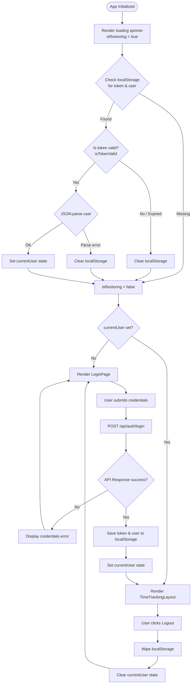

---

## 2. Work Time Logging Flow (Stopwatch vs. Manual)

This flowchart illustrates the dual logging pathways: real-time stopwatch logging and manual retrospective logging.

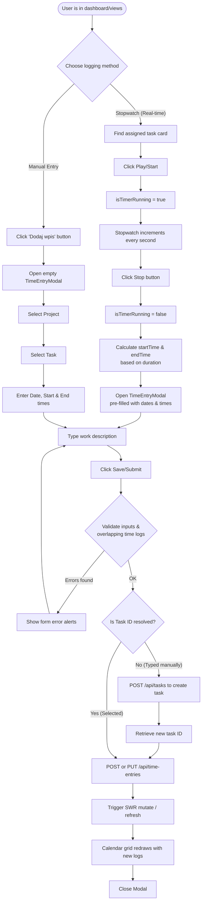

---

## 3. Report Generation & PDF Export Flow

This diagram illustrates how an Administrator generates reports client-side and prints them to a PDF document.

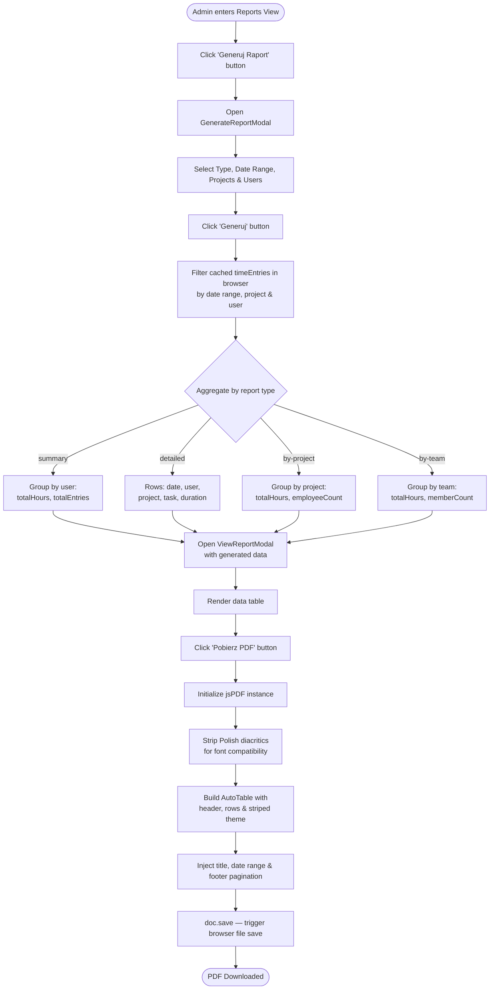

---

<!-- Source: docs/FRONTEND_USE_CASES.md -->

# Frontend Use Cases (UC)

This document describes the functional use cases implemented in the Time Tracking System frontend, divided by actor roles.

---

## 1. Actors

| Actor | Description |
| :--- | :--- |
| **Employee (Pracownik)** | Logs time against tasks, views assigned projects and tasks, and edits/deletes their own logs. |
| **Administrator (Admin)** | Has complete access to all panels. Manages projects, tasks, users, and generates summaries and reports. |

---

## 2. General Use Cases

### UC-01: User Login
- **Primary Actor**: Employee, Administrator
- **Preconditions**: User has an active account.
- **Main Flow**:
  1. User enters username and password on the Login Page.
  2. Frontend sends login payload to `/api/auth/login`.
  3. Frontend receives JWT token, User ID, and Role.
  4. Frontend stores token and user in `localStorage`.
  5. UI routes to the appropriate view (`DashboardView`).

  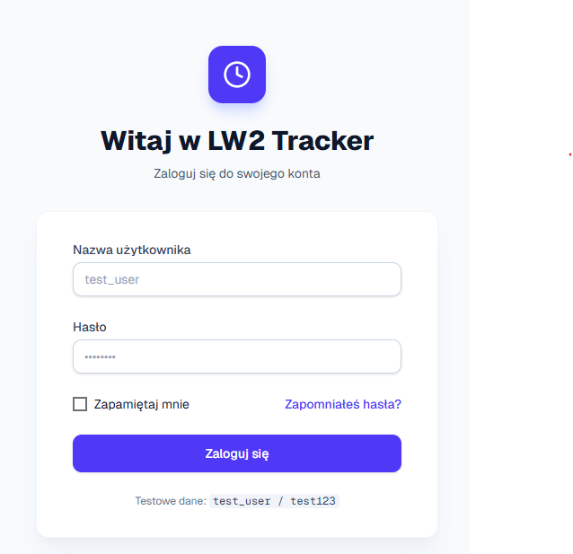

### UC-02: Session Restore
- **Primary Actor**: Employee, Administrator
- **Preconditions**: A token is stored in the browser's `localStorage`.
- **Main Flow**:
  1. Frontend initializes and reads the token.
  2. Decodes payload and checks the expiration (`exp` timestamp).
  3. If token is valid, restores login session and routes to the Dashboard immediately.
  4. If token is expired or corrupted, wipes `localStorage` and remains on the Login Page.

### UC-03: User Logout
- **Primary Actor**: Employee, Administrator
- **Preconditions**: User is logged in.
- **Main Flow**:
  1. User clicks the Logout button in the sidebar or top bar.
  2. Frontend removes `token` and `user` keys from `localStorage`.
  3. UI redirects to the login screen.

---

## 3. Employee Use Cases

### UC-04: View Dashboard (Employee)
- **Primary Actor**: Employee
- **Main Flow**:
  1. Employee navigates to Dashboard.
  2. System shows aggregated statistics for the employee:
     - Logged hours for today.
     - Logged hours for the current week.
     - Logged hours for the current month.
     - Progress bar showing current weekly hours vs. the weekly goal (40h).
  3. System displays a chart/list of recent tasks worked on.

  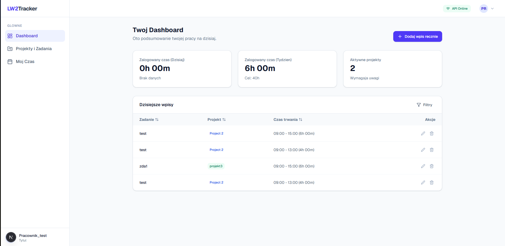

### UC-05: Log Time Manually
- **Primary Actor**: Employee
- **Preconditions**: Employee is assigned to a project/task.
- **Main Flow**:
  1. Employee clicks "Dodaj wpis" (Add time entry) on the calendar view.
  2. System displays the time logging modal.
  3. Employee selects the project.
  4. Employee selects a task (the dropdown shows tasks assigned to the user).
  5. Employee selects the date, start time, and end time.
  6. Employee enters description (optional).
  7. System validates that the end time is after the start time, and that the new entry does not overlap with existing entries.
  8. Employee submits, and the frontend sends a POST request to `/api/time-entries`.
  9. Calendar updates with the new time block.

  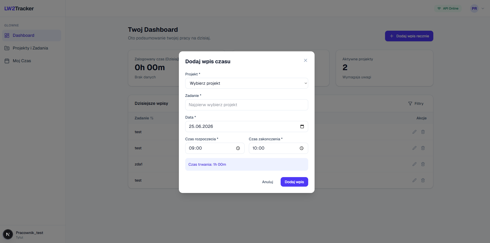

### UC-06: Use Stopwatch (Real-time Timer)
- **Primary Actor**: Employee
- **Main Flow**:
  1. Employee navigates to "Projekty i Zadania" or clicks the Quick-access panel.
  2. Employee clicks "Loguj czas" (Log time) or the play icon next to an assigned task to start the timer.
  3. Frontend starts an active timer showing hours, minutes, and seconds elapsed in the top bar.
  4. Employee clicks the stop button.
  5. Frontend stops the timer, calculates the start and end times, and pre-populates the "Dodaj wpis" modal automatically.
  6. Employee reviews details and clicks save to persist.

### UC-07: Edit / Delete Personal Time Entry
- **Primary Actor**: Employee
- **Main Flow**:
  1. Employee clicks on their time entry block in the calendar.
  2. System shows the edit modal with current details.
  3. Employee modifies fields (project, task, times, description) and clicks save (PUT request to `/api/time-entries/{id}`), OR clicks "Usuń" (Delete) (DELETE request to `/api/time-entries/{id}`).
  4. Calendar refetches and updates.

  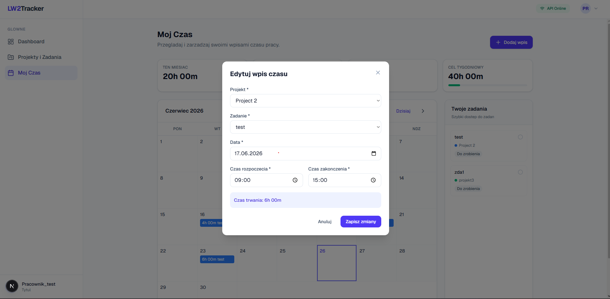

---

## 4. Administrator Use Cases

### UC-08: View Dashboard (Admin)
- **Primary Actor**: Administrator
- **Main Flow**:
  1. Admin logs in and views the Dashboard.
  2. System displays total parameters for the entire organization:
     - Total logged hours across all projects.
     - Active projects count.
     - Total employees registered.
     - Quick list of active stopwatches running in real-time.

  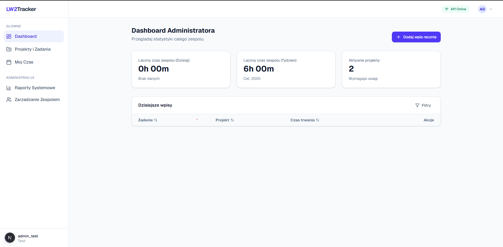

### UC-09: Create / Edit / Delete Projects
- **Primary Actor**: Administrator
- **Main Flow**:
  1. Admin navigates to the Projects View.
  2. Admin clicks "Nowy Projekt" (New Project).
  3. Admin enters project name, description, start date, and end date, and assigns a calendar highlight color.
  4. Admin saves the project (POST request to `/api/projects`).
  5. Admin can also select an existing project to edit (PUT) or delete it (DELETE).

  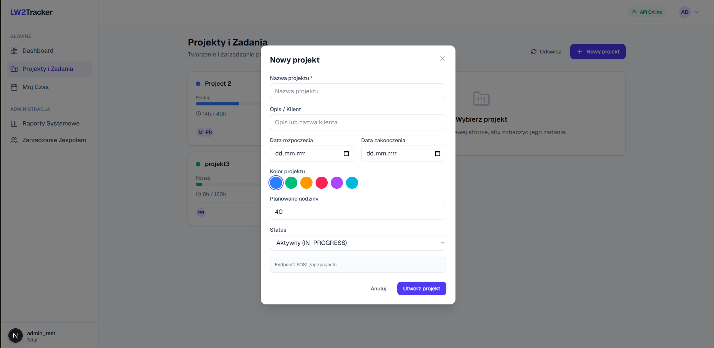

### UC-10: Manage Project Tasks
- **Primary Actor**: Administrator
- **Main Flow**:
  1. Admin selects a project in the Projects View.
  2. Admin clicks "Dodaj Zadanie" (Add Task).
  3. Admin enters task name, description, status (`TODO`, `IN_PROGRESS`, `DONE`).
  4. Admin saves the task (POST request to `/api/tasks`).
  5. Admin can click "Edytuj" (Edit) or "Usuń" (Delete) on tasks.

  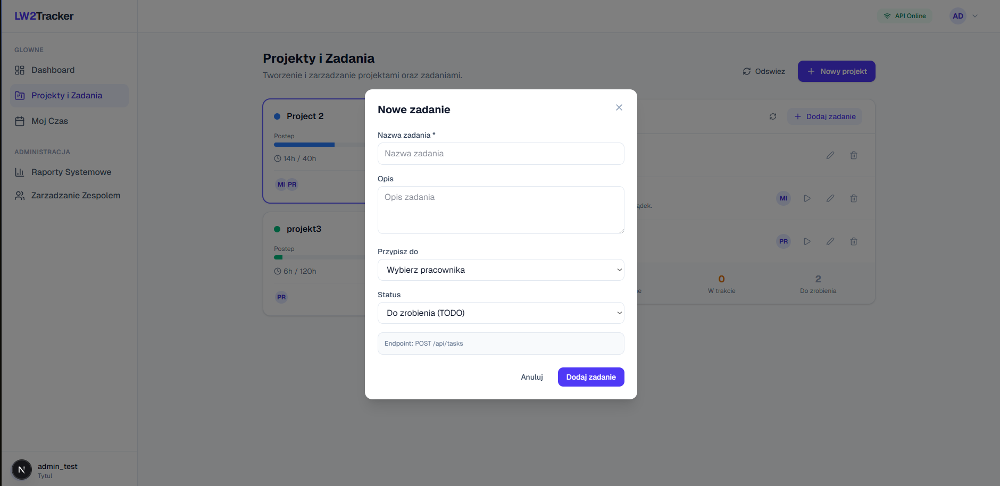

### UC-11: Assign Employee to Task
- **Primary Actor**: Administrator
- **Main Flow**:
  1. Admin clicks "Przypisz pracownika" (Assign employee) on a task card.
  2. System lists all registered employees.
  3. Admin selects an employee and saves (PUT request to `/api/tasks/{id}` with updated assignee lists).

### UC-12: Generate Reports
- **Primary Actor**: Administrator
- **Main Flow**:
  1. Admin navigates to the Reports panel.
  2. Admin clicks "Generuj Raport" (Generate Report).
  3. Admin selects parameters:
     - Report Type: Summary (Podsumowanie), Detailed (Szczegółowy), By Project, or By Team.
     - Date range (From / To).
  4. Admin submits, and the frontend queries `/api/reports/{type}` with query parameters.
  5. Frontend displays report data in a dynamic paginated table.

  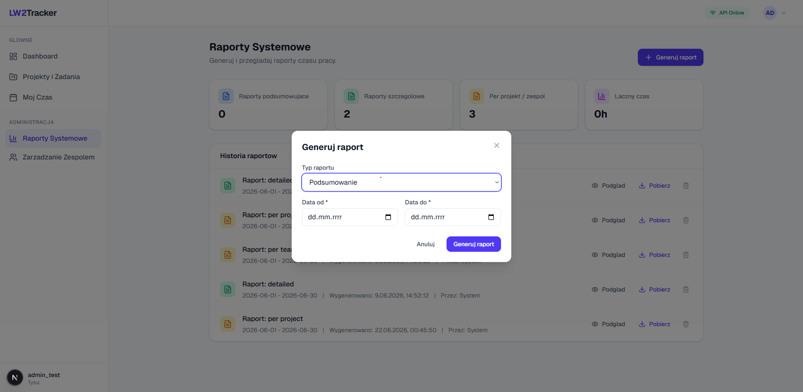

### UC-13: Export Report to PDF
- **Primary Actor**: Administrator
- **Preconditions**: Report data has been generated and is visible in the viewer modal.
- **Main Flow**:
  1. Admin clicks "Pobierz PDF" (Download PDF).
  2. System triggers the client-side PDF helper.
  3. System parses the table columns and data rows into a formatted report PDF (attaching title, parameters, headers, and footer pages).
  4. The PDF file is downloaded locally.

  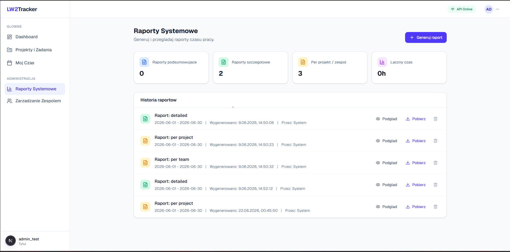

---

<!-- Source: docs/FRONTEND_USER_MANUAL.md -->

# Frontend User Manual

Welcome to the **LW2 Time Tracking Tracker** User Manual. This guide will walk you through logging in, recording your working hours, and using administrator features (managing projects, tasks, and reports).

---

## 1. Getting Started

### 1.1. Login Screen
To access the system, navigate to the web application URL:
1. Enter your **username** (Nazwa użytkownika) and **password** (Hasło).
2. (Optional) Check **Remember me** (Zapamiętaj mnie) to persist your session even after closing the browser.
3. Click **Zaloguj się** (Log In).

*Note: Your account must be created beforehand by an Administrator.*


---

## 2. Main Interface Layout

Once logged in, you will see a two-column layout:
- **Sidebar (Navigation)**: Displays the logo, active user details (role and team), and navigation buttons to switch views.
- **Main View Area**: Shows the content of the selected panel (Dashboard, Calendar, Projects, Reports, or Team).
- **Topbar**: Shows current status, active timer/stopwatch controls, and a logout button.

#### Employee Interface:


#### Administrator Interface:


---

## 3. Employee Instructions (Logging Time)

There are two ways to track your work time: using the **Stopwatch** or **Manual Entry**.

### 3.1. Logging Time via the Stopwatch (Recommended)
1. Go to **Projekty i Zadania** (Projects and Tasks) or look at the **Twoje zadania** (Your tasks) sidebar panel.
2. Find the task you are about to start.
3. Click **Loguj czas** (Log time) or the play button next to it.
4. The stopwatch in the topbar will start running.
5. When you finish working on the task, click the **Stop button** (red square) in the topbar.
6. A modal window will open with the date, start time, and end time automatically populated.
7. Enter a brief description of what you did and click **Dodaj wpis** (Add entry).

### 3.2. Logging Time Manually
If you forgot to start the stopwatch, you can add your time block manually:
1. Go to the **Mój Czas** (My Time) calendar panel.
2. Click the **Dodaj wpis** (Add entry) button at the top right.
3. Choose the **Project** and **Task** from the dropdown menus.
4. Set the **Date**, **Start Time**, and **End Time**.
5. Type a description and click **Dodaj wpis** (Add entry).


### 3.3. Reviewing and Editing Your Calendar
In the **Mój Czas** view:
- You will see a monthly calendar with color-coded blocks representing your logged entries.
- Click any entry block to open the edit modal. You can modify the hours, descriptions, or click **Usuń** (Delete) to remove the entry.
- The stats row above the calendar displays your hours logged Today, this Week, and this Month, alongside your weekly progress towards the 40-hour goal.


---

## 4. Administrator Instructions

If you are logged in as an Administrator, you will have additional views in the sidebar.

### 4.1. Project & Task Management
Navigate to **Projekty i Zadania**:
- **Create a Project**: Click **Nowy Projekt**, type the project name and client/description, choose a highlight color, and click save.

  

- **Create a Task**: Click **Dodaj zadanie** inside any project card. Enter the task name and description, select status (`TODO`, `IN_PROGRESS`, `DONE`), and save.

  

- **Assign Employees**: Click **Przypisz pracownika** (Assign employee) on a task, select an employee from the dropdown list, and save.

### 4.2. Reporting and PDF Export
Navigate to **Raporty**:
1. Click **Generuj Raport** (Generate Report).
2. Choose the type:
   - **Podsumowanie** (Summary): Total hours worked per employee.
   - **Szczegółowy** (Detailed): Exact list of time entries with dates, tasks, and descriptions.
   - **Według projektów** (By Projects): Total hours spent on each project.
   - **Według zespołów** (By Teams): Total hours logged by backend/frontend teams.
3. Set the date range (From / To).
4. Click **Generuj** to view the report in a table.

   

5. Click **Pobierz PDF** (Download PDF) to download a clean printable report page.

   

### 4.3. Team Monitoring
Navigate to **Zarządzanie Zespołem** (Team Management):
- View a table of all employees.
- Monitor active work status: if an employee is currently running a stopwatch, the table shows the task name, project, and duration counter in real-time.
- Manage user profiles: click **Nowy Użytkownik** to add new employees, or edit/delete existing accounts.

---

<!-- Source: docs/TESTING_DEVELOPER_MANUAL.md -->

# **Testing User Manual & Developer Guide**

This guide provides practical instructions for running, writing, and maintaining tests across the LW2 Time Tracking System.

## **1\. Backend Testing Guide (Java / Spring Boot)**

### **Prerequisites**

* Java Development Kit (JDK) installed.  
* **Docker Desktop** must be running in the background (required for Testcontainers in the Repository tests).

### **Running the Tests**

You can run the tests via your IDE (IntelliJ) or the command line using the Gradle wrapper.

**Option A: Command Line (Recommended for full suites)**

Open your terminal in the backend root directory and run:

\# Run all tests  
./gradlew test

**Option B: IntelliJ IDEA**

1. Navigate to the src/test/java directory in your project tree.  
2. Right-click on the controller, service, or repository folder.  
3. Select **Run 'Tests in...'** (or click the green play arrows next to the class definitions).

### **Writing a New Backend Test**

Backend tests follow the **Parallel Package** rule.

1. If you create a new class at src/main/java/.../service/ReportService.java.  
2. You MUST create its test at exactly src/test/java/.../service/ReportServiceTest.java.  
3. Annotate the test class with @ExtendWith(MockitoExtension.class) for unit tests or @WebMvcTest for controller tests.

## **2\. Frontend Testing Guide (Next.js / React)**

### **Prerequisites**

* Node.js installed.  
* Dependencies installed via pnpm install.

### **Running the Tests**

Vitest comes with a highly optimized "Watch Mode" that automatically re-runs tests the moment you save a file.

Open your terminal in the frontend root directory and run:

\# Start the test runner in interactive Watch Mode  
pnpm test

**Interactive Vitest Controls:**

While the runner is active in the terminal, you can press:

* a: Re-run all tests.  
* f: Run only failed tests.  
* q: Quit the test runner.  
* Enter: Trigger a manual re-run.

### **Writing a New Frontend Test**

Frontend tests follow the **Colocation** rule.

1. If you create a new file: components/ui/button.tsx.  
2. Create your test right next to it: components/ui/button.test.tsx.  
3. Vitest will automatically discover the new file and run it without requiring any configuration changes.

**Bypassing HTML5 Validations in UI Tests:**

When testing forms that use native HTML required attributes, fireEvent.click() will be blocked by jsdom. To test your custom JavaScript validation, bypass the click and trigger the form directly:

const form \= screen.getByPlaceholderText('Username').closest('form');  
fireEvent.submit(form\!);

---

<!-- Source: docs/TESTING_DOCUMENTATION.md -->

# **Full-Stack Testing Architecture Documentation**

This document outlines the testing strategies, technology stacks, and structural patterns used to ensure the reliability and integrity of the Time Tracking System (LW2). The architecture is divided into two distinct environments: the Spring Boot Backend and the Next.js Frontend.

## **1\. Backend Testing Architecture (Java / Spring Boot)**

The backend utilizes a strict, three-layer testing hierarchy isolating the web layer, business logic, and database layer.

### **1.1 Technology Stack**

| Technology | Purpose |
| :---- | :---- |
| **JUnit 5** | The core testing framework and execution engine. |
| **Mockito** | Simulation engine used to mock services and isolate business logic without needing a database. |
| **Spring Boot Test (MockMvc)** | Simulates incoming HTTP requests to test API endpoints and routing without starting a real web server. |
| **Testcontainers (Docker)** | Spins up temporary, disposable PostgreSQL database instances for safe database testing. |

### **1.2 Directory Structure & Scope**

Backend tests are strictly separated from production code, residing in the src/test/java/... parallel directory.

* **service/ (Unit Tests):** Tests the "Brain" of the application.  
  * *Files:* TaskServiceTest, ProjectServiceTest, UserServiceTest, AuthServiceTest, JwtServiceTest.  
  * *Scope:* Uses Mockito to bypass the database entirely. Proves that core Java logic, calculations, password hashing, and JWT token generation work correctly under various conditions.  
* **controller/ (Web Integration Tests):** Tests the "Doors" of the application.  
  * *Files:* TaskControllerTest, ProjectControllerTest, UserControllerTest, AuthControllerTest.  
  * *Scope:* Uses MockMvc. Mocks the service layer but tests the HTTP layer. Proves endpoints route correctly, handle JSON serialization, and return proper HTTP status codes (200 OK, 400 Bad Request, 401 Unauthorized).  
* **repository/ (Database Integration Tests):** Tests the "Vault" of the application.  
  * *Files:* RepositoryTest.  
  * *Scope:* Uses Testcontainers. Executes raw SQL against a real, temporary PostgreSQL database to ensure custom JPA queries save and retrieve exact records accurately.

## **2\. Frontend Testing Architecture (Next.js / React)**

The frontend utilizes a modern, component-driven testing strategy aimed at simulating real-world user interactions and data flow.

### **2.1 Technology Stack**

| Technology | Purpose |
| :---- | :---- |
| **Vitest** | A lightning-fast, Vite-native test runner optimized for modern React setups. |
| **React Testing Library (RTL)** | A toolkit that tests UI components by simulating human interactions (typing, clicking, finding elements by text). |
| **jsdom** | A lightweight "virtual browser" that runs inside the terminal, faking the DOM, HTML forms, and localStorage. |
| **jest-dom** | Extends Vitest with DOM-specific assertions (e.g., toBeInTheDocument()). |

### **2.2 Directory Structure & Scope**

The frontend uses the **Colocation** strategy: test files live in the exact same directory as the files they are testing (e.g., use-tasks.test.ts lives next to use-tasks.ts).

* **lib/ (Network & Utilities):**  
  * *Files:* api.test.ts, utils.test.ts.  
  * *Scope:* Pure logic tests. Proves that Tailwind CSS classes merge correctly and that the apiFetch wrapper successfully grabs JWT tokens from localStorage and formats outgoing HTTP requests.  
* **hooks/ (Data & State):**  
  * *Files:* use-projects.test.ts, use-tasks.test.ts, use-users.test.ts, use-mobile.test.ts, use-toast.test.ts.  
  * *Scope:* Mocks the API layer. Verifies that data slices handle loading states properly, update arrays correctly on mutations, and accurately respond to environmental changes (like resizing the virtual window).  
* **components/ (User Interface):**  
  * *Files:* login-page.test.tsx, time-tracking-layout.test.tsx.  
  * *Scope:* Uses the virtual browser to render HTML. Simulates typing and clicking to verify form validations, API dispatching, and dynamic layout rendering based on user roles.  
* **app/ (Integration & Routing):**  
  * *Files:* page.test.tsx.  
  * *Scope:* Tests the application's gatekeeper logic. Proves that users without a token are forced to the login screen, while authenticated users are successfully routed directly to the dashboard.
